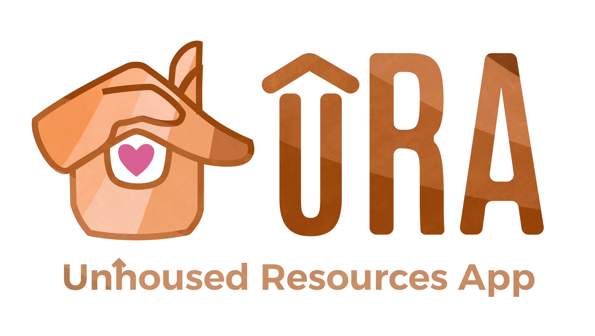

# Unhoused Resources App - Seattle/King County


## Youtube Video Demo
<a href="https://www.youtube.com/watch?v=HUvWatugRcQ" 
  target="_blank"></a>

## Description
The Unhoused Resources App aims to help the Unhoused community in the Seattle/King County area
to find either: 1) Food, 2) Shelter, 3) Medical services, 4) Hygiene services

The app uses the user's current location to find the closest locations based on their chosen resource (ex. Shelter)
It then shows a list of all available chosen resources - naturally ordered by distance - where pressing on a 
resource shows them summary information such as: Title, Google Reviews, time open, phone number, etc.

Clicking on the "directions" button allows them to go to the "map page" which uses Google maps to direct them
to their desired location

## Getting Started
### Installing
To run the project yourself, one must have installed...
1. Node.js (LTS v22.13.1 preferred) 
2. VSCode or preferred code editor/IDE
3. Expo Go app on a physical IOS or Android device
(Note: Project development can work on both Mac & Windows laptops)

To download the program
1. Git clone from: https://github.com/hcp-uw/Unhoused-resources-app/tree/main
2. cd into "Unhoused-resource-app"
3. Execute the program!

### Executing program
Once everything is installed properly...
* ```git pull``` (just to make sure)
* ```npm install``` (installs all necessary packages from package.json)
* ```npx expo start``` (follow error fixing instructions if necessary)
* Scan QR code in terminal on your "Expo Go" app for the app to run!

## Help / Common issues
- Remember to cd into "Unhoused-resources-app" on git clone!
- Remember to run "npm install" if any updates occurred!

## Authors
Note: All authors completed the React Native & Expo tutorial during the project!

* FRONTEND DEVELOPER & UI/UX: **Celestine B.** - celestinembuendia@yahoo.com
   * Original Figma designer | Home/Resource/FAQ/Settings page implementation w/ custom Dropdowns | Weather Alert API implementation <br>
* UI/UX LEAD & FRONTEND DEVELOPER: **Ian L.** - imlimasi@uw.edu
   * Proficient Figma & Canva designer and leader | List & Resource page + header implementation | Designed & polished Figma, Presentation, & Logo <br>
* PROJECT MANAGER: **Leonardo P.** - leitoparal36@gmail.com
   * Weekly meetings, documentation, TODOs | Git feature branch workflow | Supabase integration w/ Location & ResourceRow Context Providers <br>
* FULL-STACK (BACKEND) DEVELOPER: **Raahil J.** - rairai77@uw.edu
   * Map Page implementation w/ Google Maps API | Supabase functionality | Proficient at guidance to other members <br>

## License
Creative Commons License - From the Husky Coding Project

## Acknowledgments
* [Readme template](https://gist.github.com/DomPizzie/7a5ff55ffa9081f2de27c315f5018afc)
* [React Native & Expo Tutorial](https://docs.expo.dev/tutorial/introduction/)
